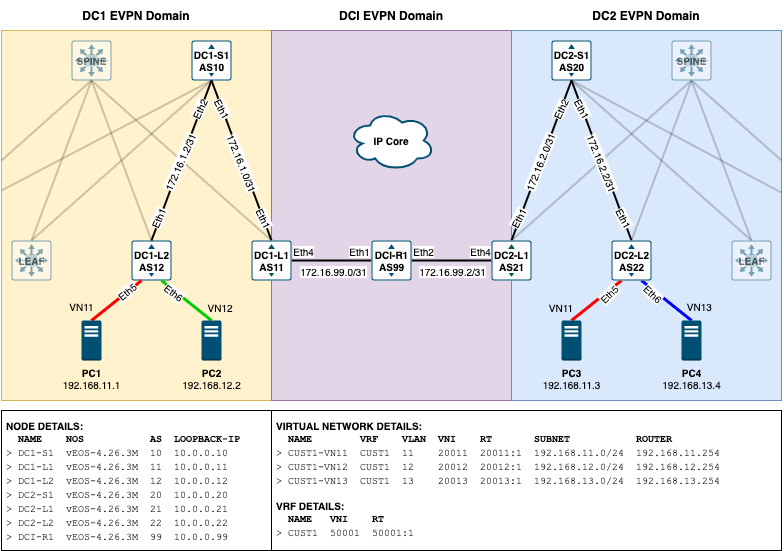

# Arista EVPN Distributed Control Plane Lab

In this lab I will be configuring two spine and leaf data centers which will be connected together via an IP only DCI. The aim in this lab is to have 3 separate EVPN domains, one for each DC and another for the DCI.

## Diagram

